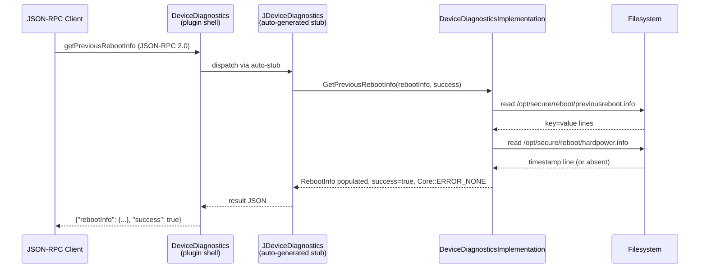

# Get Previous Reboot Info — Specification

**Callsign:** `org.rdk.DeviceDiagnostics`  
**Method:** `getPreviousRebootInfo`  
**Framework:** WPEFramework / Thunder  
**Change:** `add-get-previous-reboot-info`

---

## Overview

This specification defines the `getPreviousRebootInfo` API for the `DeviceDiagnostics` Thunder plugin. The method returns structured information about the most recent device reboot, enabling applications to include accurate diagnostic context when reporting telemetry to the SIFT analytics endpoint.

---

## Description

After any device reboot — scheduled, unscheduled, user-initiated, or system-initiated — the RDK platform writes reboot provenance to two well-known files:

- `/opt/secure/reboot/previousreboot.info` — key=value pairs containing the timestamp, source component, reason code, and custom/other reason text.
- `/opt/secure/reboot/hardpower.info` — a single line containing the timestamp of the last hard-power-reset event.

The `getPreviousRebootInfo` JSON-RPC method reads these files and returns their contents as a structured `rebootInfo` object. The method is implemented in `DeviceDiagnosticsImplementation` and exposed via the COM-RPC interface `Exchange::IDeviceDiagnostics::GetPreviousRebootInfo`. The JSON-RPC stub is auto-generated by `Exchange::JDeviceDiagnostics` — no manual `registerMethod` call is used.

The `RebootInfo` struct used in the COM-RPC signature is defined in `IDeviceDiagnostics.h` with the following fields:

```cpp
struct EXTERNAL RebootInfo {
    string timestamp       /* @text timestamp */;
    string source          /* @text source */;
    string reason          /* @text reason */;
    string customReason    /* @text customReason */;
    string otherReason     /* @text otherReason */;
    string lastHardPowerReset /* @text lastHardPowerReset */;
};
```

This feature resolves OQ-01 in `DeviceDiagnostics_Spec.md` (the `RebootInfo` struct was previously defined but not exposed via any JSON-RPC method).

---

## Requirements

### Functional Requirements

- **REQ-GPRI-001:** The plugin MUST expose the JSON-RPC method `getPreviousRebootInfo` under the `org.rdk.DeviceDiagnostics` callsign.
- **REQ-GPRI-002:** The method MUST return a `rebootInfo` object containing `timestamp`, `source`, `reason`, `customReason`, `otherReason`, and `lastHardPowerReset`.
- **REQ-GPRI-003:** Values for `timestamp`, `source`, `reason`, `customReason`, and `otherReason` MUST be read from `/opt/secure/reboot/previousreboot.info`.
- **REQ-GPRI-004:** The value for `lastHardPowerReset` MUST be read from `/opt/secure/reboot/hardpower.info`.
- **REQ-GPRI-005:** When `/opt/secure/reboot/previousreboot.info` does not exist or cannot be read, the method MUST return `success: false` and `Core::ERROR_GENERAL`.
- **REQ-GPRI-006:** When `/opt/secure/reboot/hardpower.info` does not exist or cannot be read, `lastHardPowerReset` MUST be an empty string `""` and `success` MUST still reflect the state of the primary reboot info file.
- **REQ-GPRI-007:** The method MUST return `success: true` and `Core::ERROR_NONE` when `/opt/secure/reboot/previousreboot.info` is read successfully.
- **REQ-GPRI-008:** The JSON-RPC stub MUST be auto-generated via `Exchange::JDeviceDiagnostics`; no manual `registerMethod` call SHALL be used.
- **REQ-GPRI-009:** The COM-RPC method signature SHALL be:
  ```cpp
  Core::hresult GetPreviousRebootInfo(RebootInfo& rebootInfo /* @out */, bool& success /* @out */);
  ```

### Non-Functional Requirements

- **REQ-GPRI-010:** The implementation MUST read files synchronously on each invocation; reboot info MUST NOT be cached across calls.
- **REQ-GPRI-011:** The implementation MUST NOT introduce any new build-time library dependencies; only standard `std::ifstream` file I/O is permitted.
- **REQ-GPRI-012:** The plugin shell (`DeviceDiagnostics.h` / `.cpp`) MUST NOT be modified; all logic is contained in `DeviceDiagnosticsImplementation`.

---

## Architecture / Design

The method follows the same in-process COM-RPC split architecture as all other `DeviceDiagnostics` methods:



**Key design decisions (from `design.md`):**
- **D-1:** File-based read via `std::ifstream` — no IARM/IPC dependency (consistent with `getMilestones`).
- **D-2:** Reuse existing `RebootInfo` struct — no new types needed.
- **D-3:** `@json` annotation on interface method drives auto-stub generation via `JDeviceDiagnostics`.
- **D-4:** Key=value line scan for `previousreboot.info`; single trimmed line for `hardpower.info`.
- **D-5:** `success` is driven only by `previousreboot.info` presence; `hardpower.info` absence yields empty string, not failure.

---

## External Interfaces

### JSON-RPC Interface

**Endpoint:** `http://127.0.0.1:9998/jsonrpc`  
**Namespace:** `org.rdk.DeviceDiagnostics`  
**Protocol:** JSON-RPC 2.0

#### `getPreviousRebootInfo`

Returns structured information about the most recent device reboot.

**Request:**
```json
{
    "jsonrpc": "2.0",
    "id": 42,
    "method": "org.rdk.DeviceDiagnostics.getPreviousRebootInfo"
}
```

**Response (success):**
```json
{
    "jsonrpc": "2.0",
    "id": 42,
    "result": {
        "rebootInfo": {
            "timestamp": "20200128083540",
            "source": "SystemPlugin",
            "reason": "FIRMWARE_FAILURE",
            "customReason": "API Validation",
            "otherReason": "API Validation",
            "lastHardPowerReset": "Tue Jan 28 08:22:22 UTC 2020"
        },
        "success": true
    }
}
```

**Response (failure — file missing):**
```json
{
    "jsonrpc": "2.0",
    "id": 42,
    "result": {
        "success": false
    }
}
```

| Result Field | Type | Description |
|---|---|---|
| `rebootInfo.timestamp` | string | Reboot date-time from `previousreboot.info` (key: `reboot_timestamp`) |
| `rebootInfo.source` | string | Initiating component (key: `reboot_source`) |
| `rebootInfo.reason` | string | Machine-readable reason code (key: `reboot_reason`) |
| `rebootInfo.customReason` | string | Human-readable custom reason (key: `reboot_custom_reason`) |
| `rebootInfo.otherReason` | string | Additional free-text reason (key: `reboot_other_reason`) |
| `rebootInfo.lastHardPowerReset` | string | Last hard-power-reset timestamp from `hardpower.info`; empty string if file absent |
| `success` | boolean | `true` if `previousreboot.info` was read successfully |

### COM-RPC Interface

**Method signature:**
```cpp
Core::hresult GetPreviousRebootInfo(RebootInfo& rebootInfo /* @out */, bool& success /* @out */);
```

| Return value | Condition |
|---|---|
| `Core::ERROR_NONE` | `/opt/secure/reboot/previousreboot.info` read successfully |
| `Core::ERROR_GENERAL` | File absent, unreadable, or access denied |

### Runtime File Dependencies

| File | Access | Required | Purpose |
|---|---|---|---|
| `/opt/secure/reboot/previousreboot.info` | Read | Yes | `timestamp`, `source`, `reason`, `customReason`, `otherReason` |
| `/opt/secure/reboot/hardpower.info` | Read | No | `lastHardPowerReset` (empty string if absent) |

**File format — `previousreboot.info`:**
```
reboot_timestamp=20200128083540
reboot_source=SystemPlugin
reboot_reason=FIRMWARE_FAILURE
reboot_custom_reason=API Validation
reboot_other_reason=API Validation
```

**File format — `hardpower.info`:**
```
Tue Jan 28 08:22:22 UTC 2020
```

---

## Performance

- **File read on every call:** Both files are read synchronously on each invocation; no caching. Files are expected to be < 1 KB on all known RDK platforms — latency is negligible.
- **No background thread:** The method is fully synchronous; it does not start any threads or background jobs.
- **No new library dependencies:** Implementation uses only `std::ifstream`; no curl, no IPC.

---

## Security

- **File path is fixed:** The implementation reads from the hardcoded paths `/opt/secure/reboot/previousreboot.info` and `/opt/secure/reboot/hardpower.info`. No caller-supplied path is used, eliminating path traversal risk.
- **Read-only access:** The implementation only reads these files; no write operations are performed.
- **No authentication on JSON-RPC:** Like all existing `DeviceDiagnostics` methods, there is no per-caller authentication. Any client with access to the JSON-RPC socket can invoke this method. Reboot reason data is considered non-sensitive diagnostic metadata.
- **Input validation:** The method accepts no parameters; there is nothing to validate or sanitize.

---

## Versioning & Compatibility

- **Additive change:** `getPreviousRebootInfo` is a new method; no existing JSON-RPC or COM-RPC methods are modified. Fully backward-compatible.
- **Interface version:** The `Exchange::IDeviceDiagnostics` JSON annotation remains `@json 1.0.0`; the new method is added under the same version.
- **Plugin API version:** The plugin API version (`1.1.2`) will be incremented to `1.2.0` (Minor bump — new capability, no breaking changes) as part of this change.
- **`RebootInfo` struct:** Pre-exists in `IDeviceDiagnostics.h`; this change adds the `@json` annotation and the `GetPreviousRebootInfo` method that surfaces it. No struct field changes.
- **Build flags:** No new conditional compilation flags are introduced. The method is always compiled in.

---

## Conformance Testing & Validation

### L1 Unit Tests

**File:** `Tests/L1Tests/tests/test_DeviceDiagnostics.cpp`  
**Framework:** Google Test + Google Mock

| Test Case | Scenario | Expectation |
|---|---|---|
| `getPreviousRebootInfo_success` | Both files present and readable | `rebootInfo` all six fields populated; `"success": true`; `Core::ERROR_NONE` |
| `getPreviousRebootInfo_fileNotFound` | `previousreboot.info` absent | `"success": false`; `Core::ERROR_GENERAL` |
| `getPreviousRebootInfo_hardpowerMissing` | `previousreboot.info` present, `hardpower.info` absent | `"success": true`; `"lastHardPowerReset": ""` |

### L2 Integration Tests

**File:** `Tests/L2Tests/tests/DeviceDiagnostics_L2Test.cpp`  
**Framework:** Google Test + Google Mock

| Test Case | Transport | Scenario |
|---|---|---|
| `GetPreviousRebootInfo_JSONRPC` | JSON-RPC | End-to-end invocation with file fixtures; assert full `rebootInfo` object |
| `GetPreviousRebootInfo_COMRPC` | COM-RPC | Direct `IDeviceDiagnostics::GetPreviousRebootInfo` call; assert `RebootInfo` struct populated |

### Validation Criteria

- `getPreviousRebootInfo` MUST return a valid JSON-RPC 2.0 response.
- `success: true` MUST only be returned when `previousreboot.info` was successfully read.
- `lastHardPowerReset` MUST be an empty string (not null or absent) when `hardpower.info` does not exist.
- The COM-RPC method MUST return `Core::ERROR_NONE` on success and `Core::ERROR_GENERAL` on file-read failure.

---

## Covered Code

_Implementation pending — code will be introduced as part of change `add-get-previous-reboot-info`. Planned coverage:_

- `plugin/DeviceDiagnosticsImplementation.h`:
    - `Plugin::DeviceDiagnosticsImplementation::GetPreviousRebootInfo`
- `plugin/DeviceDiagnosticsImplementation.cpp`:
    - `Plugin::DeviceDiagnosticsImplementation::GetPreviousRebootInfo`
- `Tests/L1Tests/tests/test_DeviceDiagnostics.cpp`:
    - `DeviceDiagnosticsTest::getPreviousRebootInfo_success`
    - `DeviceDiagnosticsTest::getPreviousRebootInfo_fileNotFound`
    - `DeviceDiagnosticsTest::getPreviousRebootInfo_hardpowerMissing`
- `Tests/L2Tests/tests/DeviceDiagnostics_L2Test.cpp`:
    - `GetPreviousRebootInfo_JSONRPC`
    - `GetPreviousRebootInfo_COMRPC`

---

## Open Queries

- **OQ-1 — `previousreboot.info` key names:** The exact key names in `/opt/secure/reboot/previousreboot.info` are assumed to be `reboot_timestamp`, `reboot_source`, `reboot_reason`, `reboot_custom_reason`, `reboot_other_reason` based on the `SystemServices::getPreviousRebootInfo2()` reference. Confirm with the platform team before implementation.
- **OQ-2 — `lastHardPowerReset` sentinel value:** Current decision is to return an empty string when `hardpower.info` is absent. Should a sentinel value (e.g., `"N/A"`) be returned instead? Keep under review during L1 test authoring.
- **OQ-3 — `previousreboot.info` file size:** Assumed < 1 KB on all RDK platforms based on reference implementation. Confirm no platform writes unbounded content to this file.
- **OQ-4 — Plugin version bump:** Should the plugin API version be bumped from `1.1.2` to `1.2.0` for this additive change, or is patch `1.1.3` sufficient under the project's versioning policy?

---

## References

- [design.md — Technical design for this change](../design.md)
- [proposal.md — Change proposal and motivation](../../proposal.md)
- [tasks.md — Implementation task checklist](../../tasks.md)
- [DeviceDiagnostics_Spec.md — Parent plugin specification](../../../../../specs/DeviceDiagnostics_Spec.md)
- [entservices-apis / IDeviceDiagnostics.h](https://github.com/rdkcentral/entservices-apis/tree/main/apis/DeviceDiagnostics/IDeviceDiagnostics.h)
- [Plugin.instructions.md — Plugin coding guidelines](https://github.com/rdkcentral/entservices-devicediagnostics/blob/develop/.github/instructions/Plugin.instructions.md)
- [Pluginimplementation.instructions.md — Implementation guidelines](https://github.com/rdkcentral/entservices-devicediagnostics/blob/develop/.github/instructions/Pluginimplementation.instructions.md)

---

## Change History

- [2026-04-27] - openspec-propose - Initial spec created as part of change `add-get-previous-reboot-info`; captured ADDED requirements, 4 test scenarios, COM-RPC signature, and JSON-RPC request/response contract.
- [2026-04-27] - openspec-templater - Restructured to match spec template; added Title, Overview, Description, Architecture/Design (Mermaid sequence diagram), External Interfaces, Performance, Security, Versioning & Compatibility, Conformance Testing & Validation, Covered Code, Open Queries, References, and Change History sections.
