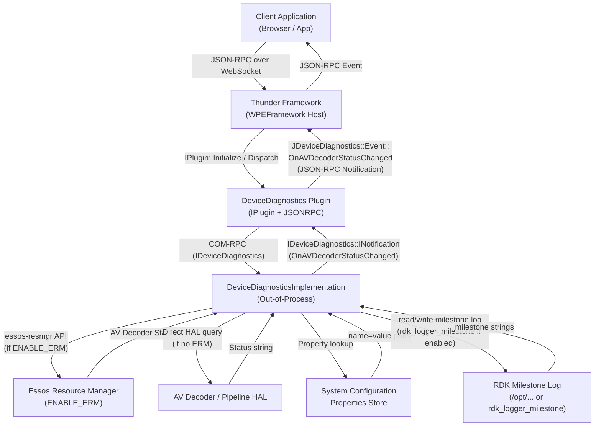

# DeviceDiagnostics

## Overview
The DeviceDiagnostics plugin provides an interface for device diagnostics within the Thunder framework. It enables clients to query AV decoder status, retrieve configuration properties, list milestones, and log milestone markers. The plugin operates as a WPEFramework out-of-process plugin and integrates with system APIs and hardware drivers as needed.

## Description
The DeviceDiagnostics plugin exposes device health and diagnostic information to clients via JSON-RPC, focusing on AV decoder pipeline status and RDK milestone tracking. It is implemented as a Thunder (`WPEFramework`) plugin split into two layers:

- **DeviceDiagnostics** — the thin Thunder IPlugin wrapper that handles lifecycle (Initialize/Deinitialize), JSON-RPC registration via auto-generated `JDeviceDiagnostics` stubs, and event forwarding.
- **DeviceDiagnosticsImplementation** — the out-of-process implementation (hosted in a separate process) that contains the actual business logic: reading AV decoder status (optionally via the Essos Resource Manager), querying system configuration properties, reading milestone logs, and writing milestone markers.

The plugin is activated by the Thunder framework on demand or at startup (depending on configuration) and communicates with clients exclusively through JSON-RPC over the Thunder COM-RPC / WebSocket transport.

## Requirements
- The plugin SHALL expose a JSON-RPC method `getAVDecoderStatus` that returns the most active status of the audio/video decoder or pipeline as a string.
- The plugin SHALL expose a JSON-RPC method `getConfiguration` that, given an array of property names, returns a list of name-value pairs with the corresponding system configuration values.
- The plugin SHALL expose a JSON-RPC method `getMilestones` that returns a list of milestone strings from the RDK milestones log.
- The plugin SHALL expose a JSON-RPC method `logMilestone` that accepts a marker string and writes it to the RDK milestones log.
- The plugin SHALL emit a `onAVDecoderStatusChanged` JSON-RPC notification when the AV decoder or pipeline status changes.
- The plugin SHALL be implemented as a Thunder out-of-process plugin, with the implementation class hosted in a separate process.
- The plugin SHALL register and unregister its JSON-RPC interface during `Initialize` and `Deinitialize` respectively.
- The plugin SHALL handle remote process disconnection by cleaning up resources and logging an appropriate error.
- When compiled with `ENABLE_ERM`, the plugin SHALL poll the Essos Resource Manager at a configurable interval to detect AV decoder status changes.
- When compiled with `RDK_LOG_MILESTONE`, the plugin SHALL use the RDK logger milestone API to write milestone entries.
- Each API method SHALL return a `success` boolean field where applicable.
- The plugin callsign SHALL default to `org.rdk.DeviceDiagnostics`.
- The plugin SHALL be versioned as Major=1, Minor=1, Patch=2.

## Architecture / Design

**Key internal components:**
- `DeviceDiagnostics::Notification` — implements `IDeviceDiagnostics::INotification` and `RPC::IRemoteConnection::INotification`; bridges implementation-side events to the JSON-RPC layer.
- `DeviceDiagnosticsImplementation::Job` — `Core::IDispatch` job used to dispatch events asynchronously from the implementation to registered notification subscribers.
- `JDeviceDiagnostics` (auto-generated) — JSON-RPC stub that maps JSON-RPC method names to `IDeviceDiagnostics` interface calls.

## External Interfaces

### JSON-RPC Methods

#### `getAVDecoderStatus`
- **Category:** AV Diagnostics
- **Description:** Gets the most active status of the audio/video decoder or pipeline.
- **Input parameters:** None
- **Response fields:**
  | Field | Type | Description |
  |---|---|---|
  | `avDecoderStatus` | string | Current AV decoder/pipeline status |
- **Error conditions:** Returns error if the implementation process is unavailable.

---

#### `getConfiguration`
- **Category:** Configuration
- **Description:** Gets the values for the specified system property names.
- **Input parameters:**
  | Parameter | Type | Required | Description |
  |---|---|---|---|
  | `names` | string[] | Required | Array of property names to query |
- **Response fields:**
  | Field | Type | Description |
  |---|---|---|
  | `paramList` | array | Array of `{ name: string, value: string }` objects |
  | `success` | boolean | `true` if the call succeeded |
- **Error conditions:** Returns `success: false` if any property cannot be retrieved.

---

#### `getMilestones`
- **Category:** Milestone Tracking
- **Description:** Returns a list of milestone strings from the RDK milestones log.
- **Input parameters:** None
- **Response fields:**
  | Field | Type | Description |
  |---|---|---|
  | `milestones` | string[] | List of milestone strings |
  | `success` | boolean | `true` if the call succeeded |
- **Error conditions:** Returns an empty list with `success: false` if the log is unavailable.

---

#### `logMilestone`
- **Category:** Milestone Tracking
- **Description:** Logs a marker string to the RDK milestones log.
- **Input parameters:**
  | Parameter | Type | Required | Description |
  |---|---|---|---|
  | `marker` | string | Required | The marker string to record |
- **Response fields:**
  | Field | Type | Description |
  |---|---|---|
  | `success` | boolean | `true` if the marker was written successfully |
- **Error conditions:** Returns `success: false` if the write fails.

---

### JSON-RPC Notifications

#### `onAVDecoderStatusChanged`
- **Description:** Triggered when the AV decoder or pipeline status changes.
- **Event parameters:**
  | Parameter | Type | Description |
  |---|---|---|
  | `avDecoderStatusChange` | string | New AV decoder status value |

## Performance
_Not applicable — no explicit performance requirements defined._

## Security
_Not applicable — no explicit security model defined. Consider restricting access to authorized clients based on deployment requirements._

## Versioning & Compatibility
- **Plugin version:** Major=1, Minor=1, Patch=2 (as defined in `DeviceDiagnostics.cpp`).
- **Callsign:** `org.rdk.DeviceDiagnostics`
- **Library name:** `libWPEFrameworkDeviceDiagnostics.so`
- **Autostart:** Configurable via plugin configuration.
- No explicit backward-compatibility policy is defined in the existing spec. Additions should be additive to avoid breaking existing clients.

## Conformance Testing & Validation
- **L1 Tests (Unit Tests):** Located at `Tests/L1Tests/tests/test_DeviceDiagnostics.cpp`. Tests cover individual method behavior using mocked interfaces.
- **L2 Tests (Integration Tests):** Located at `Tests/L2Tests/tests/DeviceDiagnostics_L2Test.cpp`. Tests exercise the plugin via the Thunder framework.
- **Build configuration:** Test CMake files at `Tests/L1Tests/CMakeLists.txt` and `Tests/L2Tests/CMakeLists.txt`.
- Coverage targets: all four JSON-RPC methods and the `onAVDecoderStatusChanged` notification.

## Covered Code
_Generated from codebase scan on 2026-04-26_

- plugin/DeviceDiagnostics.cpp:
    - DeviceDiagnostics::Initialize
    - DeviceDiagnostics::Deinitialize
    - DeviceDiagnostics::Information
    - DeviceDiagnostics::Deactivated

- plugin/DeviceDiagnostics.h:
    - DeviceDiagnostics (class declaration)
    - DeviceDiagnostics::Notification (inner class)

- plugin/DeviceDiagnosticsImplementation.cpp:
    - DeviceDiagnosticsImplementation::Register
    - DeviceDiagnosticsImplementation::Unregister
    - DeviceDiagnosticsImplementation::dispatchEvent
    - DeviceDiagnosticsImplementation::Dispatch
    - DeviceDiagnosticsImplementation::getMostActiveDecoderStatus
    - DeviceDiagnosticsImplementation::onDecoderStatusChange
    - DeviceDiagnosticsImplementation::GetConfiguration
    - DeviceDiagnosticsImplementation::GetMilestones
    - DeviceDiagnosticsImplementation::LogMilestone
    - DeviceDiagnosticsImplementation::GetAVDecoderStatus
    - DeviceDiagnosticsImplementation::getConfig

- plugin/DeviceDiagnosticsImplementation.h:
    - DeviceDiagnosticsImplementation (class declaration)
    - DeviceDiagnosticsImplementation::Job (inner class)

- plugin/Module.cpp:
    - MODULE_NAME_DECLARATION

- plugin/Module.h:
    - Module macro definitions

---

## Open Queries
- The exact set of valid `avDecoderStatus` string values is not enumerated in the existing spec. A formal enum or list of valid states should be documented.
- The property names accepted by `getConfiguration` and their valid values are not specified. A reference to the system properties store or a list of supported keys should be added.
- The file path(s) read by `getMilestones` are not specified. The implementation source should be referenced to confirm the exact path(s).
- No explicit security or trust-level policy is defined. Access control requirements (e.g., allowed origins, token-based auth) should be clarified for production deployments.
- The exact behavior when `ENABLE_ERM` is not defined (i.e., how AV decoder status is obtained) is not documented in the spec.

## References
- [DeviceDiagnostics API documentation](https://github.com/rdkcentral/entservices-apis/blob/develop/docs/apis/DeviceDiagnostics.md)
- [IDeviceDiagnostics.h interface](https://github.com/rdkcentral/entservices-apis/blob/develop/apis/DeviceDiagnostics/IDeviceDiagnostics.h)
- [Thunder Framework](https://rdkcentral.github.io/Thunder/)

## Change History
- [2026-04-26] - openspec-templater - Updated "Covered Code" section with codebase scan (includes new GetPreviousRebootInfo method).
- [2026-04-23] - openspec-templater - Regenerated to match spec template format.removed GetPreviousRebootInfo - new change not yet merge
