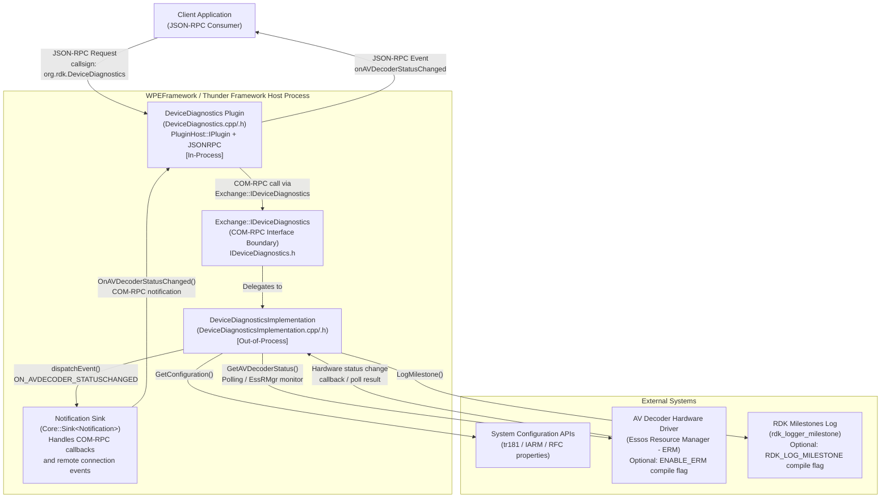

# DeviceDiagnostics Plugin Specification

## Overview

The DeviceDiagnostics plugin provides an interface for device diagnostics within the Thunder (WPEFramework) framework. It enables clients to query AV decoder status, retrieve configuration properties, list milestones, and log milestone markers. The plugin is identified by the callsign `org.rdk.DeviceDiagnostics` and is designed to integrate with system APIs and hardware drivers via a COM-RPC out-of-process implementation.

---

## Description

The DeviceDiagnostics plugin exposes device health and diagnostic information to clients via JSON-RPC. It is composed of two layers:

1. **DeviceDiagnostics** — the in-process Thunder plugin that handles JSON-RPC dispatch and event routing.
2. **DeviceDiagnosticsImplementation** — the out-of-process component that implements the `Exchange::IDeviceDiagnostics` COM-RPC interface and interacts directly with system APIs, hardware AV decoder drivers, and the RDK milestones logging facility.

The plugin is registered under the Thunder module name `Plugin_DeviceDiagnostics` and can be configured to autostart with the framework. It notifies subscribed clients of AV decoder/pipeline status changes via the `onAVDecoderStatusChanged` event.

**Plugin Configuration:**

| Parameter   | Value                                      |
|-------------|--------------------------------------------|
| callsign    | `org.rdk.DeviceDiagnostics`                |
| classname   | `DeviceDiagnostics`                        |
| locator     | `libWPEFrameworkDeviceDiagnostics.so`      |
| autostart   | configurable (boolean)                     |

---

## Requirements

- **FR-1:** The plugin SHALL expose an API (`getAVDecoderStatus`) to retrieve the current most-active status of the audio/video decoder or pipeline.
- **FR-2:** The plugin SHALL expose an API (`getConfiguration`) to retrieve configuration property values by supplying an array of property names, returning a list of name-value pairs.
- **FR-3:** The plugin SHALL expose an API (`getMilestones`) to retrieve the current list of recorded milestone strings.
- **FR-4:** The plugin SHALL expose an API (`logMilestone`) to write a caller-supplied marker string to the RDK milestones log.
- **FR-5:** The plugin SHALL emit a JSON-RPC event notification (`onAVDecoderStatusChanged`) to all subscribed clients when the AV decoder/pipeline status changes.
- **FR-6:** The plugin SHALL support autostart configuration so it can be started automatically when the Thunder framework initialises.
- **FR-7:** The plugin SHALL be uniquely identified by the callsign `org.rdk.DeviceDiagnostics`.
- **FR-8:** The plugin SHALL delegate all diagnostic operations to the `DeviceDiagnosticsImplementation` component via the `Exchange::IDeviceDiagnostics` COM-RPC interface.
- **FR-9:** The plugin SHALL be extensible — new diagnostic methods or properties can be added without breaking existing clients.

---

## Architecture / Design

### Component Diagram

### Component Descriptions

| Component | Role |
|-----------|------|
| **Client Application** | Any JSON-RPC consumer (e.g. resident app, test harness) that invokes methods on `org.rdk.DeviceDiagnostics` and subscribes to its events. |
| **DeviceDiagnostics Plugin** | In-process Thunder plugin. Acts as the JSON-RPC gateway: receives JSON-RPC requests, forwards them via COM-RPC to the implementation, and routes notification callbacks back to subscribed clients as JSON-RPC events. Also handles graceful deactivation if the out-of-process component crashes (remote connection deactivation). |
| **Notification Sink** | Internal class (`Core::Sink<Notification>`) that implements both `Exchange::IDeviceDiagnostics::INotification` and `RPC::IRemoteConnection::INotification`. Translates COM-RPC status-change callbacks into JSON-RPC events dispatched through `JDeviceDiagnostics::Event`. |
| **Exchange::IDeviceDiagnostics** | COM-RPC interface boundary defined in `IDeviceDiagnostics.h`. Decouples the in-process plugin from the out-of-process implementation, enabling process isolation and independent lifecycle management. |
| **DeviceDiagnosticsImplementation** | Out-of-process component that performs the real work: queries system configuration APIs, polls or monitors the EssRMgr (Essos Resource Manager) for AV decoder hardware status, and writes milestone markers to the RDK logging facility. Notifies registered `INotification` observers on state changes. |
| **System Configuration APIs** | Platform-level APIs (e.g. tr181 data model, IARM bus, RFC) queried by `GetConfiguration()` to return property name-value pairs. |
| **AV Decoder Hardware Driver (ERM)** | Essos Resource Manager (`EssRMgr`) used (when `ENABLE_ERM` is set) to query or monitor audio/video decoder pipeline status. A background poll thread (`AVPollThread`) periodically samples `getMostActiveDecoderStatus()`. |
| **RDK Milestones Log** | Platform logging sink (enabled by `RDK_LOG_MILESTONE`) used by `LogMilestone()` to record timing/lifecycle marker strings for boot and performance analysis. |

### Data Flow Summary

1. **Query flow (synchronous):** Client → JSON-RPC → Plugin → COM-RPC → Implementation → System API/Driver → response propagated back up the same chain.
2. **Event flow (asynchronous):** AV Decoder Driver → Implementation poll/callback → `dispatchEvent()` → `Core::IDispatch` job → `INotification::OnAVDecoderStatusChanged()` → Notification Sink → `JDeviceDiagnostics::Event::OnAVDecoderStatusChanged()` → JSON-RPC event to all subscribed clients.

---

## External Interfaces

### JSON-RPC Methods

All methods are invoked via the Thunder JSON-RPC protocol using callsign `org.rdk.DeviceDiagnostics`.

---

#### `getAVDecoderStatus`

Returns the current most-active status of the audio/video decoder or pipeline.

| Field       | Value         |
|-------------|---------------|
| Method      | `getAVDecoderStatus` |
| Parameters  | None          |

**Response:**

| Field            | Type   | Description                                      |
|------------------|--------|--------------------------------------------------|
| `avDecoderStatus` | string | Current status of the AV decoder/pipeline.       |

---

#### `getConfiguration`

Returns the values for a supplied list of configuration property names.

| Field       | Value              |
|-------------|--------------------|
| Method      | `getConfiguration` |

**Request Parameters:**

| Field   | Type       | Required | Description                          |
|---------|------------|----------|--------------------------------------|
| `names` | `string[]` | Yes      | Array of property name strings to query. |

**Response:**

| Field       | Type                                    | Description                                       |
|-------------|-----------------------------------------|---------------------------------------------------|
| `paramList` | `Array<{ name: string, value: string }>` | List of name-value pairs for the requested properties. |
| `success`   | `boolean`                               | `true` if the operation succeeded; `false` otherwise. |

---

#### `getMilestones`

Returns the current list of recorded milestone strings.

| Field       | Value           |
|-------------|-----------------|
| Method      | `getMilestones` |
| Parameters  | None            |

**Response:**

| Field        | Type       | Description                          |
|--------------|------------|--------------------------------------|
| `milestones` | `string[]` | Array of milestone strings.          |
| `success`    | `boolean`  | `true` if the operation succeeded; `false` otherwise. |

---

#### `logMilestone`

Logs a caller-supplied marker string to the RDK milestones log.

| Field       | Value          |
|-------------|----------------|
| Method      | `logMilestone` |

**Request Parameters:**

| Field    | Type     | Required | Description                            |
|----------|----------|----------|----------------------------------------|
| `marker` | `string` | Yes      | The milestone marker string to log.    |

**Response:**

| Field     | Type      | Description                                            |
|-----------|-----------|--------------------------------------------------------|
| `success` | `boolean` | `true` if the marker was written successfully; `false` otherwise. |

---

### JSON-RPC Events

#### `onAVDecoderStatusChanged`

Emitted when the AV decoder or pipeline status changes. Clients must subscribe to this event.

**Event Payload:**

| Field                  | Type     | Description                                          |
|------------------------|----------|------------------------------------------------------|
| `avDecoderStatusChange` | `string` | The new status of the AV decoder/pipeline after the change. |

---

### Data Models

| Model                     | Type                              | Description                                                  |
|---------------------------|-----------------------------------|--------------------------------------------------------------|
| AV Decoder Status         | `string`                          | String representing the current state of the AV decoder/pipeline. |
| Configuration Property    | `{ name: string, value: string }` | A single name-value pair from the system configuration.       |
| Milestones List           | `string[]`                        | Ordered list of milestone marker strings.                    |
| Success Flag              | `boolean`                         | Indicates whether an operation completed successfully.        |

---

## Performance

_Not applicable — no performance goals, latency targets, or throughput benchmarks have been defined for this plugin. See Open Queries._

---

## Security

- Access control policy for the `org.rdk.DeviceDiagnostics` plugin has not yet been defined. Deployment environments should restrict JSON-RPC access to authorized clients only.
- See Open Queries for the outstanding security definition item.

---

## Versioning & Compatibility

_Not applicable — no versioning scheme, compatibility guarantees, or migration paths have been defined for this plugin. See Open Queries._

---

## Conformance Testing & Validation

_Not applicable — no formal test strategy or automated validation criteria have been defined at the spec level. L1 and L2 test suites exist under `Tests/` but are not yet mapped to individual requirements. See Open Queries._

---

## Covered Code

- `plugin/DeviceDiagnostics.cpp`
    - `DeviceDiagnostics::Initialize`
    - `DeviceDiagnostics::Deinitialize`
    - `DeviceDiagnostics::Information`
    - `DeviceDiagnostics::Deactivated`
- `plugin/DeviceDiagnostics.h`
    - `DeviceDiagnostics` (class declaration)
    - `DeviceDiagnostics::Notification` (inner notification sink class)
- `plugin/DeviceDiagnosticsImplementation.cpp`
    - `DeviceDiagnosticsImplementation::GetAVDecoderStatus`
    - `DeviceDiagnosticsImplementation::GetConfiguration`
    - `DeviceDiagnosticsImplementation::GetMilestones`
    - `DeviceDiagnosticsImplementation::LogMilestone`
    - `DeviceDiagnosticsImplementation::Register`
    - `DeviceDiagnosticsImplementation::Unregister`
    - `DeviceDiagnosticsImplementation::dispatchEvent`
    - `DeviceDiagnosticsImplementation::Dispatch`
    - `DeviceDiagnosticsImplementation::getMostActiveDecoderStatus`
    - `DeviceDiagnosticsImplementation::onDecoderStatusChange`
    - `DeviceDiagnosticsImplementation::getConfig`
    - `DeviceDiagnosticsImplementation::AVPollThread` _(conditional: ENABLE_ERM)_
- `plugin/DeviceDiagnosticsImplementation.h`
    - `DeviceDiagnosticsImplementation` (class declaration)
    - `DeviceDiagnosticsImplementation::Job` (async dispatch job class)
    - `DeviceDiagnosticsImplementation::Event` (enum)
- `plugin/Module.cpp`
    - Thunder module registration entry point
- `plugin/Module.h`
    - `MODULE_NAME` definition (`Plugin_DeviceDiagnostics`)

---

## Open Queries

- **Security policy undefined:** No access control model, token/credential requirements, or client authorization scheme has been specified for `org.rdk.DeviceDiagnostics`. This must be defined before production deployment.
- **AV Decoder Status values not enumerated:** The `avDecoderStatus` / `avDecoderStatusChange` string field has no defined set of valid values or enum. A normative list of possible states (e.g. `ACTIVE`, `IDLE`, `PAUSED`) should be documented.
- **Performance targets not defined:** No latency, response time, or throughput requirements have been established. Should minimum/maximum response times be specified for `getAVDecoderStatus` or `getConfiguration`?
- **Configuration property names not documented:** The `getConfiguration` API accepts arbitrary property name strings, but no authoritative list of supported property names and their semantics is provided in this spec.
- **ERM dependency behaviour undefined:** `GetAVDecoderStatus` behaviour when compiled without `ENABLE_ERM` (i.e. no Essos Resource Manager) is not documented. What is the fallback return value?
- **RDK_LOG_MILESTONE behaviour undefined:** `LogMilestone` behaviour when compiled without `RDK_LOG_MILESTONE` is not documented. Does it silently succeed or return an error?
- **Error codes not specified:** No error codes or failure response schemas are defined for any of the four API methods beyond the boolean `success` flag.
- **Versioning scheme absent:** No versioning policy or backward-compatibility guarantee has been specified. How will breaking changes to the API be managed?
- **Conformance test coverage:** L1/L2 test suites exist under `Tests/` but have not been mapped to individual functional requirements. Traceability matrix should be established.
- **Extensibility model:** The spec states the plugin can be extended with new diagnostic methods, but no formal extension process or versioning mechanism has been defined.

---

## References

- [DeviceDiagnostics.md](https://github.com/rdkcentral/entservices-apis/blob/develop/docs/apis/DeviceDiagnostics.md)
- [Thunder Framework](https://rdkcentral.github.io/Thunder/)
- [IDeviceDiagnostics.h](https://github.com/rdkcentral/entservices-apis/blob/develop/apis/DeviceDiagnostics/IDeviceDiagnostics.h)

---

## Change History

- [2026-04-23] - openspec-templater - Restructured to match spec template; excluded GetPreviousRebootInfo API; added Mermaid architecture diagram.
