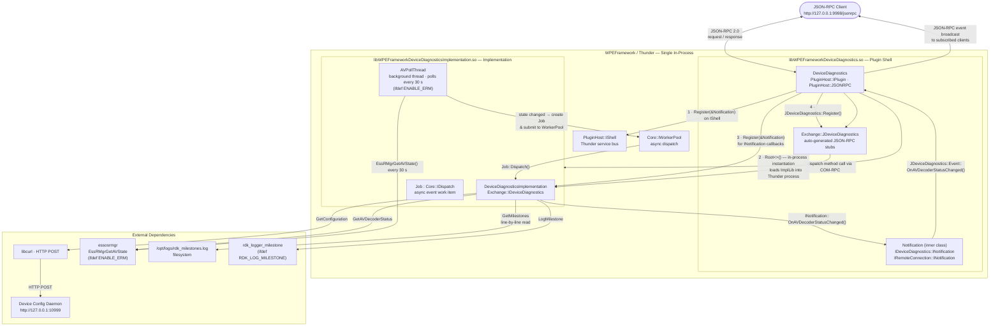

# DeviceDiagnostics Plugin — Specification

**Version:** 1.1.2  
**Callsign:** `org.rdk.DeviceDiagnostics`  
**Framework:** WPEFramework / Thunder  
**License:** Apache License 2.0  
**Copyright:** 2025 RDK Management

---

## Overview

The `DeviceDiagnostics` plugin is a Thunder framework plugin for RDK-based devices that exposes device diagnostic capabilities over JSON-RPC. It provides four methods and one asynchronous notification event, surfacing AV decoder pipeline state, device configuration properties, and RDK milestone log data.

**Core Capabilities:**

| Capability | Description |
|---|---|
| AV Decoder Status Query | Returns the most active state of the audio/video decoder pipeline |
| AV Decoder Status Notification | Broadcasts an event when decoder state changes |
| Device Configuration Query | Retrieves device configuration key-value pairs from a local daemon |
| Milestone Retrieval | Reads milestone entries from `/opt/logs/rdk_milestones.log` |
| Milestone Logging | Appends a custom marker string to the RDK milestones log |

---

## Description

The `DeviceDiagnostics` plugin follows the Thunder **in-process split** pattern. A lightweight plugin shell (`DeviceDiagnostics`) runs in-process with the Thunder framework and handles all JSON-RPC routing. The actual diagnostic work is performed by a separate implementation library (`DeviceDiagnosticsImplementation`) that is loaded into the same Thunder process and communicates with the shell via COM-RPC.

The interface (`Exchange::IDeviceDiagnostics`) is defined in `IDeviceDiagnostics.h` with JSON tag `1.0.0`. Auto-generated JSON-RPC stubs (`Exchange::JDeviceDiagnostics`) are registered during plugin `Initialize` and unregistered during `Deinitialize`.

The implementation relies on:
- **libcurl** for querying device configuration properties from a local daemon at `127.0.0.1:10999`.
- **Essos Resource Manager (EssRMgr)** (`essosrmgr`) for polling AV decoder pipeline state, available only when `ENABLE_ERM` is compiled in.
- **RDK Logger Milestone API** (`rdk_logger_milestone.h`) for writing milestone log entries, available only when `RDK_LOG_MILESTONE` is compiled in.
- **File I/O** on `/opt/logs/rdk_milestones.log` for reading existing milestones.

### Plugin Lifecycle

#### `Initialize(IShell* service)`

1. Stores the `service` reference and increments its refcount.
2. Registers `_deviceDiagnosticsNotification` with the service shell (for remote connection lifecycle events).
3. Instantiates `DeviceDiagnosticsImplementation` in-process via `service->Root<>()` with a 5-second timeout (the implementation is loaded as a separate shared library within the same Thunder process).
4. If instantiation succeeds:
   - Registers `_deviceDiagnosticsNotification` for `IDeviceDiagnostics::INotification` callbacks.
   - Registers auto-generated JSON-RPC stubs: `Exchange::JDeviceDiagnostics::Register(*this, _deviceDiagnostics)`.
5. Returns an empty string on success, or an error message string on failure.

#### `Deinitialize(IShell* service)`

1. Unregisters `_deviceDiagnosticsNotification` from the service shell.
2. If `_deviceDiagnostics` is valid:
   - Calls `_deviceDiagnostics->Unregister(&_deviceDiagnosticsNotification)`.
   - Calls `Exchange::JDeviceDiagnostics::Unregister(*this)`.
   - Releases the `_deviceDiagnostics` interface (expects `Core::ERROR_DESTRUCTION_SUCCEEDED`).
   - If a connection reference exists: retrieves and terminates it via `service->RemoteConnection(_connectionId)`.
3. Releases the service reference.

#### Connection Deactivation Handling

The `Notification` inner class implements `RPC::IRemoteConnection::INotification`. On `Deactivated()`, `DeviceDiagnostics::Deactivated()` is called to ensure resource cleanup if the implementation is deactivated unexpectedly.

### Implementation Details

#### AV Decoder Status Polling (`ENABLE_ERM`)

A background thread (`AVPollThread`) queries `EssRMgrGetAVState` every 30 seconds (`AVDECODERSTATUS_RETRY_INTERVAL`). An `onAVDecoderStatusChanged` event is dispatched asynchronously via `Core::IWorkerPool` only when the status changes.

```
AVPollThread loop:
  wait_for(30 seconds) or stop signal
  if m_pollThreadRun == 0: break
  EssRMgrGetAVState(m_EssRMgr, &status)
  if status != lastStatus:
    lastStatus = status
    onDecoderStatusChange(status)
      → dispatchEvent(ON_AVDECODER_STATUSCHANGED)
          → WorkerPool → Dispatch()
              → INotification::OnAVDecoderStatusChanged(...)
```

#### Configuration Retrieval (`GetConfiguration`)

- Sends HTTP POST to `http://127.0.0.1:10999` with payload `{"paramList": [{"name": "PropertyName"}, ...]}`.
- Response is parsed using raw `std::string::find` (not a JSON parser).
- Considers HTTP 200 or HTTP 0 as success. Curl timeout: 30 seconds.

#### Milestone Log (`GetMilestones` / `LogMilestone`)

- `GetMilestones` reads `/opt/logs/rdk_milestones.log` line-by-line using `getFileContent()`.
- `LogMilestone` calls `logMilestone(marker.c_str())` when `RDK_LOG_MILESTONE` is defined; without the flag, returns success without writing.

#### Thread Safety

- `_adminLock` (`Core::CriticalSection`) guards the notification subscriber list in `Register`, `Unregister`, and `Dispatch`.
- `m_AVDecoderStatusLock` (`std::mutex`) and `m_avDecoderStatusCv` (`std::condition_variable`) guard the poll thread lifecycle.

---

## Requirements

### Functional Requirements

- **REQ-DD-001:** The plugin MUST expose the JSON-RPC method `getAVDecoderStatus` returning one of: `"IDLE"`, `"PAUSED"`, `"ACTIVE"`.
- **REQ-DD-002:** The plugin MUST expose the JSON-RPC method `getConfiguration` accepting an array of property name strings and returning the corresponding key-value pairs.
- **REQ-DD-003:** The plugin MUST expose the JSON-RPC method `getMilestones` returning all lines from `/opt/logs/rdk_milestones.log`.
- **REQ-DD-004:** The plugin MUST expose the JSON-RPC method `logMilestone` accepting a non-empty marker string and writing it to the RDK milestone log.
- **REQ-DD-005:** The plugin MUST fire the event `onAVDecoderStatusChanged` whenever the AV decoder pipeline status transitions between `IDLE`, `PAUSED`, and `ACTIVE`.
- **REQ-DD-006:** `logMilestone` MUST return `success: false` and `Core::ERROR_GENERAL` when the `marker` parameter is empty.
- **REQ-DD-007:** `getMilestones` MUST return `success: false` and `Core::ERROR_GENERAL` when `/opt/logs/rdk_milestones.log` does not exist or cannot be read.
- **REQ-DD-008:** The plugin MUST support multiple simultaneous notification subscribers via `Register`/`Unregister`.
- **REQ-DD-009:** Duplicate `Register` calls with the same notification pointer MUST be rejected without error return (but should log an error).

### Non-Functional Requirements

- **REQ-DD-010:** Both the plugin shell (`DeviceDiagnostics`) and the implementation (`DeviceDiagnosticsImplementation`) MUST run in-process within the same Thunder process; the implementation MUST be loaded as a separate shared library (`libWPEFrameworkDeviceDiagnosticsImplementation.so`).
- **REQ-DD-011:** JSON-RPC stubs MUST be registered using auto-generated `Exchange::JDeviceDiagnostics` classes, not manual `Register()` calls.
- **REQ-DD-012:** The plugin MUST implement `PluginHost::IPlugin` and `PluginHost::IDispatcher`.
- **REQ-DD-013:** The plugin MUST use `SERVICE_REGISTRATION(DeviceDiagnostics, 1, 1, 2)` to register with Thunder.
- **REQ-DD-014:** The plugin MUST handle implementation deactivation events via `RPC::IRemoteConnection::INotification::Deactivated`.

### Configuration Requirements

| Parameter | Type | Default | Description |
|---|---|---|---|
| `callsign` | string | `org.rdk.DeviceDiagnostics` | Plugin instance name |
| `classname` | string | `DeviceDiagnostics` | Class name |
| `locator` | string | `libWPEFrameworkDeviceDiagnostics.so` | Plugin shared library |
| `autostart` | boolean | `false` | Plugin does not start automatically |
| `startuporder` | string | `""` (configurable) | Startup ordering position |
| `precondition` | array | `["Platform"]` | Thunder subsystem dependencies required before activation |
| `root.mode` | string | `LOCAL` | Execution mode (set to `LOCAL` for in-process execution within the Thunder process) |
| `root.locator` | string | `libWPEFrameworkDeviceDiagnosticsImplementation.so` | In-process implementation library |

### Build Requirements

| CMake Option | Description |
|---|---|
| `PLUGIN_DEVICEDIAGNOSTICS_STARTUPORDER` | Sets startup order string |
| `PLUGIN_DEVICEDIAGNOSTICS_MODE` | Sets execution mode (`LOCAL`/`CONTAINER`) |
| `BUILD_ENABLE_ERM` | Enables Essos Resource Manager for AV decoder polling |

Both build targets require **C++11** (`CXX_STANDARD 11`).

---

## Architecture / Design

The plugin follows the Thunder in-process plugin split architecture:



**Key design decisions:**
- The plugin shell (`DeviceDiagnostics`) and the implementation (`DeviceDiagnosticsImplementation`) both run within the same Thunder process; the implementation is loaded as a separate shared library (`libWPEFrameworkDeviceDiagnosticsImplementation.so`).
- The plugin shell handles all JSON-RPC routing via auto-generated `Exchange::JDeviceDiagnostics` stubs; method calls are dispatched to the implementation via in-process COM-RPC.
- Notification delivery uses the COM-RPC `IDeviceDiagnostics::INotification` callback chain within the same process.
- The `Notification` inner class implements both `Exchange::IDeviceDiagnostics::INotification` (for business events) and `RPC::IRemoteConnection::INotification` (for deactivation handling).

---

## External Interfaces

### JSON-RPC Interface

**Endpoint:** `http://127.0.0.1:9998/jsonrpc`  
**Namespace:** `org.rdk.DeviceDiagnostics`  
**Protocol:** JSON-RPC 2.0

#### Methods

##### `getAVDecoderStatus`

Gets the most active status of the audio/video decoder pipeline.

**Request:**
```json
{
    "jsonrpc": "2.0",
    "id": 1,
    "method": "org.rdk.DeviceDiagnostics.getAVDecoderStatus"
}
```

**Response:**
```json
{
    "jsonrpc": "2.0",
    "id": 1,
    "result": {
        "avDecoderStatus": "IDLE"
    }
}
```

| Result Field | Type | Possible Values |
|---|---|---|
| `avDecoderStatus` | string | `"IDLE"` \| `"PAUSED"` \| `"ACTIVE"` |

---

##### `getConfiguration`

Gets device configuration values for the specified property names.

**Request:**
```json
{
    "jsonrpc": "2.0",
    "id": 2,
    "method": "org.rdk.DeviceDiagnostics.getConfiguration",
    "params": ["Device.X_CISCO_COM_LED.RedPwm", "Device.DeviceInfo.X_RDKCENTRAL-COM_FirmwareFilename"]
}
```

**Response:**
```json
{
    "jsonrpc": "2.0",
    "id": 2,
    "result": {
        "paramList": [
            {"name": "Device.X_CISCO_COM_LED.RedPwm", "value": "123"},
            {"name": "Device.DeviceInfo.X_RDKCENTRAL-COM_FirmwareFilename", "value": "DEVICE_FIRMWARE_v1.0.bin"}
        ],
        "success": true
    }
}
```

| Parameter | Type | Description |
|---|---|---|
| `params` | `string[]` | Array of configuration property name strings |

| Result Field | Type | Description |
|---|---|---|
| `paramList` | `object[]` | Array of `{name, value}` pairs |
| `success` | boolean | `true` if query succeeded |

---

##### `getMilestones`

Returns the list of milestones from the RDK milestones log file.

**Request:**
```json
{
    "jsonrpc": "2.0",
    "id": 3,
    "method": "org.rdk.DeviceDiagnostics.getMilestones"
}
```

**Response:**
```json
{
    "jsonrpc": "2.0",
    "id": 3,
    "result": {
        "milestones": [
            "2024-01-01 00:00:01 FirmwareDownloadStarted",
            "2024-01-01 00:01:05 FirmwareDownloadCompleted"
        ],
        "success": true
    }
}
```

| Result Field | Type | Description |
|---|---|---|
| `milestones` | `string[]` | Each line from `/opt/logs/rdk_milestones.log` |
| `success` | boolean | `true` if file was read successfully |

---

##### `logMilestone`

Appends a custom marker string to the RDK milestones log.

**Request:**
```json
{
    "jsonrpc": "2.0",
    "id": 4,
    "method": "org.rdk.DeviceDiagnostics.logMilestone",
    "params": {"marker": "AppLaunch_StartTime"}
}
```

**Response:**
```json
{
    "jsonrpc": "2.0",
    "id": 4,
    "result": {
        "success": true
    }
}
```

| Parameter | Type | Constraint | Description |
|---|---|---|---|
| `marker` | string | Non-empty | Marker string to log |

---

##### `getPreviousRebootInfo`

Returns structured information about the most recent device reboot, for use in SIFT telemetry and diagnostics.

**Request:**
```json
{
    "jsonrpc": "2.0",
    "id": 5,
    "method": "org.rdk.DeviceDiagnostics.getPreviousRebootInfo"
}
```

**Response:**
```json
{
    "jsonrpc": "2.0",
    "id": 5,
    "result": {
        "rebootInfo": {
            "timestamp": "20200128083540",
            "source": "SystemPlugin",
            "reason": "FIRMWARE_FAILURE",
            "customReason": "API Validation",
            "otherReason": "API Validation",
            "lastHardPowerReset": "Tue Jan 28 08:22:22 UTC 2020"
        },
        "success": true
    }
}
```

| Result Field | Type | Description |
|---|---|---|
| `rebootInfo.timestamp` | string | Reboot date-time from `previousreboot.info` |
| `rebootInfo.source` | string | Initiating component |
| `rebootInfo.reason` | string | Machine-readable reason code |
| `rebootInfo.customReason` | string | Human-readable custom reason |
| `rebootInfo.otherReason` | string | Additional free-text reason |
| `rebootInfo.lastHardPowerReset` | string | Last hard-power-reset timestamp; empty string if `hardpower.info` absent |
| `success` | boolean | `true` if `/opt/secure/reboot/previousreboot.info` was read successfully |

---

#### Events

##### `onAVDecoderStatusChanged`

Triggered when the most active AV decoder pipeline status changes.

**Event Payload:**
```json
{
    "jsonrpc": "2.0",
    "method": "org.rdk.DeviceDiagnostics.onAVDecoderStatusChanged",
    "params": {
        "avDecoderStatusChange": "ACTIVE"
    }
}
```

| Param Field | Type | Possible Values |
|---|---|---|
| `avDecoderStatusChange` | string | `"IDLE"` \| `"PAUSED"` \| `"ACTIVE"` |

**Delivery:** Requires JSON-RPC client subscription. Only fires when `ENABLE_ERM` is compiled in.

---

### COM-RPC Interface (`Exchange::IDeviceDiagnostics`)

**Interface file:** `IDeviceDiagnostics.h`  
**Namespace:** `WPEFramework::Exchange`  
**Interface ID:** `ID_DEVICE_DIAGNOSTICS`  
**JSON annotation:** `@json 1.0.0 @text:keep`

#### Data Types

| Type | Description |
|---|---|
| `ParamList` | Name-value pair: `{string name, string value}` |
| `AvDecoderStatusResult` | `{string avDecoderStatus}` — one of `IDLE`, `PAUSED`, `ACTIVE` |
| `RebootInfo` | `{timestamp, source, reason, customReason, otherReason, lastHardPowerReset}` — exposed via `getPreviousRebootInfo` |
| `IStringIterator` | `RPC::IIteratorType<string, RPC::ID_STRINGITERATOR>` |
| `IDeviceDiagnosticsParamListIterator` | `RPC::IIteratorType<ParamList, ID_DEVICE_DIAGNOSTICS_PARAM_LIST_ITERATOR>` |

#### Methods

| Method | Signature | Direction | Description |
|---|---|---|---|
| `Register` | `(INotification*)` | in | Register notification subscriber |
| `Unregister` | `(INotification*)` | in | Unregister notification subscriber |
| `GetConfiguration` | `(IStringIterator* names, IDeviceDiagnosticsParamListIterator*& paramList @out, bool& success @out)` | in/out | Retrieve config properties |
| `GetMilestones` | `(IStringIterator*& milestones @out, bool& success @out)` | out | Read milestone log |
| `LogMilestone` | `(const string& marker, bool& success @out)` | in/out | Write milestone entry |
| `GetAVDecoderStatus` | `(AvDecoderStatusResult& AVDecoderStatus @out)` | out | Query decoder pipeline state |
| `GetPreviousRebootInfo` | `(RebootInfo& rebootInfo @out, bool& success @out)` | out | Return previous reboot provenance from filesystem |

#### Error Return Summary

| Scenario | `hresult` | `success` |
|---|---|---|
| `GetConfiguration` curl failure or HTTP error | `Core::ERROR_GENERAL` | `false` |
| `GetMilestones` file not found or read error | `Core::ERROR_GENERAL` | `false` |
| `LogMilestone` empty marker | `Core::ERROR_GENERAL` | `false` |
| `GetPreviousRebootInfo` — `previousreboot.info` missing or unreadable | `Core::ERROR_GENERAL` | `false` |
| `Unregister` notification not found | `Core::ERROR_GENERAL` | N/A |
| `Register` duplicate | `Core::ERROR_NONE` | N/A |
| `GetAVDecoderStatus` (no ERM) | `Core::ERROR_NONE` | N/A (returns `"IDLE"`) |
| Plugin initialization failure | error string from `Initialize()` | N/A |
| Implementation deactivated | `Deactivated()` triggers cleanup | N/A |

### External System Dependencies

| Dependency | Type | Endpoint / Path | Purpose |
|---|---|---|---|
| WPEFramework / Thunder | Framework | — | Plugin hosting, COM-RPC, JSON-RPC |
| `libcurl` | Runtime library | `http://127.0.0.1:10999` | HTTP POST for `getConfiguration` |
| `essosrmgr` | Runtime library | — | AV decoder state via `EssRMgrGetAVState` |
| `rdk_logger_milestone.h` | Compile-time | — | Writing milestone log entries |
| Device configuration daemon | Runtime service | `http://127.0.0.1:10999` | Config key-value backend |
| Milestone log file | Filesystem | `/opt/logs/rdk_milestones.log` | Source for `getMilestones` |
| Previous reboot info file | Filesystem | `/opt/secure/reboot/previousreboot.info` | Source for `getPreviousRebootInfo` — `timestamp`, `source`, `reason`, `customReason`, `otherReason` |
| Hard power reset file | Filesystem | `/opt/secure/reboot/hardpower.info` | Source for `getPreviousRebootInfo` — `lastHardPowerReset` (optional; empty string if absent) |

---

## Performance

- **AV Decoder poll interval:** 30 seconds (`AVDECODERSTATUS_RETRY_INTERVAL`). Events are only emitted on state change, not every poll cycle.
- **Configuration query curl timeout:** 30 seconds (`curlTimeoutInSeconds`). Callers should be prepared for up to 30-second latency on `getConfiguration`.
- **Plugin initialization timeout:** 5 seconds for in-process `Root<>()` instantiation of `DeviceDiagnosticsImplementation`.
- **Notification dispatch model:** Asynchronous via `Core::IWorkerPool` — event delivery does not block the poll thread.
- **Thread model:** One dedicated background poll thread for AV decoder state; all other operations are synchronous.

---

## Security

- **Localhost-only communication:** The configuration daemon at `127.0.0.1:10999` and the Thunder JSON-RPC endpoint at `127.0.0.1:9998` are only accessible on loopback. No network exposure by design.
- **No authentication on `getConfiguration` backend:** The HTTP POST to port 10999 does not include any authentication headers. This is acceptable for a local-only daemon but should be reviewed if the daemon is ever exposed on a non-loopback interface.
- **No input sanitization on `getConfiguration`:** Property name strings from callers are forwarded directly to the local daemon without allowlist validation. Malformed or oversized property names could affect the daemon.
- **`logMilestone` accepts arbitrary strings:** Any non-empty string can be written to the milestone log. There is no length limit or character validation.
- **In-process execution:** The plugin shell and implementation both run within the same Thunder process. There is no OS-level process isolation between the shell and the implementation; fault isolation relies on Thunder's error handling mechanisms rather than process boundaries.
- **No caller identity verification:** Thunder JSON-RPC does not enforce per-method access control for this plugin. Any client with access to the JSON-RPC socket can invoke all methods.

---

## Versioning & Compatibility

- **Plugin API version:** `1.1.2` (Major: 1, Minor: 1, Patch: 2) — registered via `SERVICE_REGISTRATION(DeviceDiagnostics, 1, 1, 2)`.
- **Interface JSON version:** `1.0.0` (annotated via `@json 1.0.0` in `IDeviceDiagnostics.h`).
- **C++ standard:** C++11 minimum.
- **`RebootInfo` struct:** Defined in the interface but not yet exposed via any JSON-RPC method. Adding a method in a future minor version would be backward-compatible.
- **`ENABLE_ERM` / `RDK_LOG_MILESTONE` flags:** Platforms without these flags have reduced functionality (no AV events, no real milestone writes) but maintain API compatibility — methods return success with default values.

---

## Conformance Testing & Validation

### L1 Unit Tests

**File:** `Tests/L1Tests/tests/test_DeviceDiagnostics.cpp`  
**Framework:** Google Test + Google Mock  
**Approach:** Unit tests with mocked `IDeviceDiagnostics` interface, `ServiceMock`, `COMLinkMock`, and `WorkerPoolImplementation`.

**Test fixture:** `DeviceDiagnosticsTest`
- Instantiates `Plugin::DeviceDiagnostics` and its JSON-RPC handler
- Uses `NiceMock<ServiceMock>`, `NiceMock<COMLinkMock>`, `NiceMock<DeviceDiagnosticsMock>`
- Spins up a `WorkerPoolImplementation` with 2 threads
- Calls `Initialize` / `Deinitialize` in setUp/tearDown

**Expected scenarios:**
- `getConfiguration`: valid input, empty names array, curl failure
- `getMilestones`: file exists with content, file missing
- `logMilestone`: valid non-empty marker, empty marker (expect failure)
- `getAVDecoderStatus`: ERM-enabled path, non-ERM path (expects `"IDLE"`)
- `onAVDecoderStatusChanged`: notification dispatch end-to-end

### L2 Integration Tests

**File:** `Tests/L2Tests/tests/DeviceDiagnostics_L2Test.cpp`  
**Framework:** Google Test + Google Mock  
**Approach:** Integration tests using real Thunder plugin activation via the Thunder framework and COM-RPC.

**Key structures:**
- `DiagnosticsNotificationHandler`: COM-RPC `INotification` implementation with `std::condition_variable` for async event signalling
- `AsyncHandlerMock_DevDiag`: JSON-RPC event mock for `onAVDecoderStatusChanged`
- `AV_POLL_TIMEOUT (31)`: Waits 31 seconds to allow one full AV poll cycle to complete

**Expected scenarios:**
- End-to-end JSON-RPC method invocation for all four methods
- COM-RPC notification delivery for `onAVDecoderStatusChanged` after real decoder state transition
- AV status poll cycle validation (state change detected within one poll interval)

### Validation Criteria

- All four JSON-RPC methods must return valid JSON-RPC 2.0 responses.
- `success: true` must only be returned when the underlying operation actually succeeds.
- `onAVDecoderStatusChanged` must not fire if the decoder status has not changed.
- Plugin must cleanly initialize and deinitialize without resource leaks (verified by Thunder destruction assertions).

---

## Covered Code

- `IDeviceDiagnostics.h`:
    - `Exchange::IDeviceDiagnostics`
    - `Exchange::IDeviceDiagnostics::INotification`
    - `Exchange::IDeviceDiagnostics::ParamList`
    - `Exchange::IDeviceDiagnostics::AvDecoderStatusResult`
    - `Exchange::IDeviceDiagnostics::RebootInfo`
    - `Exchange::IDeviceDiagnostics::GetConfiguration`
    - `Exchange::IDeviceDiagnostics::GetMilestones`
    - `Exchange::IDeviceDiagnostics::LogMilestone`
    - `Exchange::IDeviceDiagnostics::GetAVDecoderStatus`
    - `Exchange::IDeviceDiagnostics::Register`
    - `Exchange::IDeviceDiagnostics::Unregister`
- `plugin/DeviceDiagnostics.h`:
    - `Plugin::DeviceDiagnostics`
    - `Plugin::DeviceDiagnostics::Notification`
    - `Plugin::DeviceDiagnostics::Notification::OnAVDecoderStatusChanged`
    - `Plugin::DeviceDiagnostics::Notification::Deactivated`
- `plugin/DeviceDiagnostics.cpp`:
    - `Plugin::DeviceDiagnostics::DeviceDiagnostics`
    - `Plugin::DeviceDiagnostics::~DeviceDiagnostics`
    - `Plugin::DeviceDiagnostics::Initialize`
    - `Plugin::DeviceDiagnostics::Deinitialize`
    - `Plugin::DeviceDiagnostics::Information`
    - `Plugin::DeviceDiagnostics::Deactivated`
- `plugin/DeviceDiagnosticsImplementation.h`:
    - `Plugin::DeviceDiagnosticsImplementation`
    - `Plugin::DeviceDiagnosticsImplementation::Job`
- `plugin/DeviceDiagnosticsImplementation.cpp`:
    - `Plugin::DeviceDiagnosticsImplementation::DeviceDiagnosticsImplementation`
    - `Plugin::DeviceDiagnosticsImplementation::~DeviceDiagnosticsImplementation`
    - `Plugin::DeviceDiagnosticsImplementation::Register`
    - `Plugin::DeviceDiagnosticsImplementation::Unregister`
    - `Plugin::DeviceDiagnosticsImplementation::GetConfiguration`
    - `Plugin::DeviceDiagnosticsImplementation::GetMilestones`
    - `Plugin::DeviceDiagnosticsImplementation::LogMilestone`
    - `Plugin::DeviceDiagnosticsImplementation::GetAVDecoderStatus`
    - `Plugin::DeviceDiagnosticsImplementation::GetPreviousRebootInfo`
    - `Plugin::DeviceDiagnosticsImplementation::getConfig`
    - `Plugin::DeviceDiagnosticsImplementation::getMostActiveDecoderStatus`
    - `Plugin::DeviceDiagnosticsImplementation::onDecoderStatusChange`
    - `Plugin::DeviceDiagnosticsImplementation::AVPollThread`
    - `Plugin::DeviceDiagnosticsImplementation::dispatchEvent`
    - `Plugin::DeviceDiagnosticsImplementation::Dispatch`
    - `getFileContent` (free function — reads file lines into a `std::list<std::string>`)
    - `writeCurlResponse` (static free function — curl write callback for accumulating HTTP response)
- `plugin/Module.h`:
    - `MODULE_NAME` (`Plugin_DeviceDiagnostics`)
- `plugin/Module.cpp`:
    - `MODULE_NAME_DECLARATION(BUILD_REFERENCE)`
- `plugin/CMakeLists.txt`:
    - Target `WPEFrameworkDeviceDiagnostics`
    - Target `WPEFrameworkDeviceDiagnosticsImplementation`
- `Tests/L1Tests/tests/test_DeviceDiagnostics.cpp`:
    - `DeviceDiagnosticsTest` fixture
- `Tests/L2Tests/tests/DeviceDiagnostics_L2Test.cpp`:
    - `DiagnosticsNotificationHandler`
    - `AsyncHandlerMock_DevDiag`

---

## Open Queries

- **OQ-01 — `RebootInfo` struct:** ~~Resolved~~ — `RebootInfo` is now exposed via the `getPreviousRebootInfo` method added in change `add-get-previous-reboot-info` (2026-04-27). Interface PR to `entservices-apis` required to complete the `@json` annotation and stub regeneration.
- **OQ-02 — Configuration daemon at port 10999:** The configuration backend at `http://127.0.0.1:10999` is not documented. What service/process is expected to run there? What are its uptime guarantees, restart policy, and authentication model?
- **OQ-03 — Raw string JSON parsing in `getConfig`:** The response from the configuration daemon is parsed using raw `std::string::find` operations rather than a JSON library. Is this intentional (e.g., performance, dependency avoidance), or a known technical debt item?
- **OQ-04 — Configurable AV poll interval:** `AVDECODERSTATUS_RETRY_INTERVAL` is a compile-time constant (30 seconds). Should this be made configurable via the plugin configuration file for different platform needs?
- **OQ-05 — `LogMilestone` silent no-op without `RDK_LOG_MILESTONE`:** The method returns `success: true` even when `RDK_LOG_MILESTONE` is not defined and no write occurs. Is this the intended contract, or should it return `success: false` or a distinct status to inform callers that logging is not active?
- **OQ-06 — AV decoder status on non-ERM platforms:** `getAVDecoderStatus` always returns `"IDLE"` when `ENABLE_ERM` is not compiled in. Is there an alternative decoder status source available for non-ERM platforms, or is `IDLE` acceptable as a default?
- **OQ-07 — Plugin activation trigger:** `autostart` is `false`. What is the expected activation trigger in production deployments? Which orchestrator or application is responsible for activating this plugin?
- **OQ-08 — Access control:** No per-caller authentication or method-level access control is specified. Should methods that write data (e.g., `logMilestone`) be restricted to privileged callers?
- **OQ-09 — `getConfiguration` input validation:** Property name strings are forwarded to the daemon without validation. Should there be allowlist validation or length limits to prevent abuse or daemon errors?
- **OQ-10 — Default `startuporder`:** The startup order is empty by default. What is the expected ordering relative to dependent plugins or system services?
- **OQ-11 — `getConfiguration` curl error handling:** Currently, HTTP 0 (no response code) is treated as success alongside HTTP 200. Is this intentional, and what does HTTP 0 represent in the context of the local daemon?

---

## References

- [IDeviceDiagnostics.h — Interface definition](IDeviceDiagnostics.h)
- [DeviceDiagnostics.md — Plugin documentation](DeviceDiagnostics.md)
- [Thunder Framework](https://rdkcentral.github.io/Thunder/)
- [entservices-apis / IDeviceDiagnostics.h](https://github.com/rdkcentral/entservices-apis/tree/main/apis/DeviceDiagnostics/IDeviceDiagnostics.h)
- [Plugin.instructions.md — Plugin coding guidelines](https://github.com/rdkcentral/entservices-devicediagnostics/blob/develop/.github/instructions/Plugin.instructions.md)
- [Pluginimplementation.instructions.md — Implementation guidelines](https://github.com/rdkcentral/entservices-devicediagnostics/blob/develop/.github/instructions/Pluginimplementation.instructions.md)

---

## Change History

- [2026-04-27] - openspec-templater - Restructured to match spec template; added Requirements, Architecture/Design, External Interfaces, Performance, Security, Versioning & Compatibility, Conformance Testing & Validation, Covered Code, Open Queries, References, and Change History sections from original technical specification content.
- [2026-04-27] - openspec-templater - Re-applied template: updated plugin execution model from out-of-process to in-process throughout spec; replaced ASCII architecture diagram with Mermaid flowchart; refreshed Covered Code section with free functions `getFileContent` and `writeCurlResponse` and `Module.cpp` declaration identified by codebase scan.
